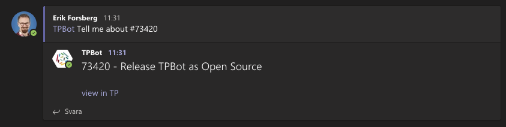

# Outgoing Webhook for Microsoft Teams and Target Process

This is a program that serves as an outgoing webhook for Microsoft Teams,
making it possible for users to mention [Target Process][tp] items in a conversation
and get a response with a link and some metadata about the item.

# Installation

As per the [Teams Documentation for Outgoing Webhooks][webhook-docs], you need a publically available
web server that can receive the request. This program itself will start a web server, but it currently
has no support for https, which is a requirement.

Therefore, you should place tpbot behind a reverse proxy such as Nginx, serving https using a public
TLS certificate, for example one from Let's Encrypt.

Install the python package in a virtualenv, and start the program as follows:

   teams-tp-webhook-server -c /etcteams-tp-webhook.conf --port 8071
   
The above example will expose the webhook on port 8071, which means this is the port your reverse
proxy should use as upstream.

Ensure the URL of your targetprocess installation as well as a read-only TP Authentication token is added
to the configuration file.

# Configuration

Each team in your Microsoft Teams setup must create an outgoing webhook for this bot to work. The
procedure is as follows:

1. The team owner should ask the administrator of the bot for a new integration, and provide the name of the team.
1. The bot administrator should reply with a string which will be part of the URL, and is added to the
   configuration file (see [example-configuration.conf](example-configuration.conf)).
   If the base URL of the tpbot is https://tpbot.example.com/tpbot, then one example team-specific URL would be
   https://tpbot.example.com/tpbot/team-one. This is called a *callback URL*, and is the URL that
   will be called by the Microsoft Teams Servers when the bot is mentioned. 
1. The team owner should now click on *Manage Team*, then on *Apps*, and in the lower right, *Create outgoing webhook*
1. The team owner should enter the callback URL, and give the bot a name. 
1. The team owner should click Save. This will produce an authentication token, that should be sent to the
   tpbot administrator.
1. The tpbot administrator will configure the URL and the authentication token into the configuration file
   for tpbot, and restart tpbot.
1. The team owner can now test by mentioning a Targetprocess item and tagging the name of the bot. See example 
   above. 

[tp]: https://targetprocess.com
[webhook-docs]: https://docs.microsoft.com/en-us/microsoftteams/platform/webhooks-and-connectors/how-to/add-outgoing-webhook